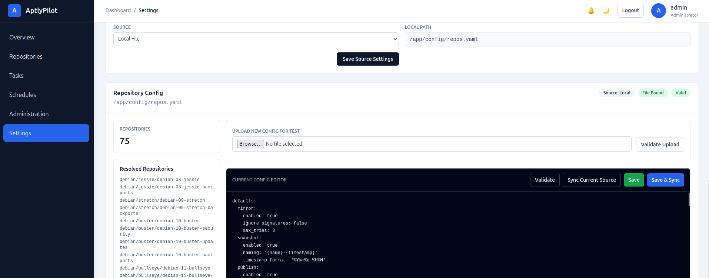

# Repository as Code Guide

## Overview

AptlyPilot uses the **Repository as Code** approach to manage Aptly
repositories.

Instead of manually creating mirrors, snapshots, and published
repositories through Aptly CLI/API, all repository definitions are
declared in a YAML file and stored locally or in Git.

The YAML file becomes the single source of truth for:

-   Repository sources
-   Mirror configuration
-   Snapshot lifecycle
-   Publishing configuration
-   Repository testing
-   Retention policies
-   Synchronization schedules


## Repository Configuration File

The repository definition file is a YAML document.
For a complete example, see the [repos.yaml file](./repos.yaml).

The configuration contains two main sections:

``` yaml
defaults:
  ...

repos:
  ...
```


### defaults

The `defaults` section defines global behavior.

These values are inherited by all repositories unless they are
overridden at the repository level.

Example:

``` yaml
defaults:

  mirror:
    enabled: true
    ignore_signatures: false
    max_tries: 3

  snapshot:
    enabled: true
    naming: '{name}-{timestamp}'
    timestamp_format: '%Y%m%d-%H%M'

  publish:
    enabled: true
    endpoint: filesystem:repository
    gpg_key: XXXXXXXXXXXXXXXXXXX
    skip_signing: false
    acquire_by_hash: true
    skip_bz2: true
    skip_contents: true

  retention:
    keep_last: 3

  schedule:
    enabled: true
    type: weekly
```

Each pipeline stage can be enabled or disabled using the `enabled`
parameter.

Example:

``` yaml
publish:
  enabled: false
```

In this case, AptlyPilot skips the publish stage for that repository.


### repos

Repositories are defined under the `repos` section.

All parameters defined in `defaults` can be overridden for a specific
repository.

Structure:

``` yaml
repos:
  <repository-family>:
    <distribution>:
      <repository-name>:
```

Example:

``` yaml
repos:
  debian:
    bookworm:
      debian-12-bookworm:
        mirror:
          archive_url: https://deb.debian.org/debian
          distribution: bookworm
          components:
            - main
            - contrib
            - non-free
          architectures:
            - amd64
        schedule:
          enabled: true
          type: daily
```


## Schedule

The `schedule` section controls automatic execution of repository
pipelines.

When `schedule.enabled` is set to `true`, AptlyPilot automatically
creates a schedule based on the defined interval.

Supported schedule types:

-   daily
-   weekly
-   monthly

Example:

``` yaml
schedule:
  enabled: true
  type: weekly
```

Based on this configuration, AptlyPilot automatically executes the
repository lifecycle pipeline:

    Schedule Trigger  ->  Mirror  ->  Snapshot  ->  Test  ->  Publish  ->  Cleanup 

The schedule can be defined globally in `defaults` or customized for an
individual repository under `repos`.


## Configuration Parameters

All parameters can be defined in both `defaults` and individual
repository definitions. Repository-level values override default values.

| Parameter | Description | Example |
| --------- | ----------- | ------- |
| mirror.enabled | Enable or disable mirror synchronization stage | true |
| mirror.ignore_signatures | Ignore repository signature validation | false |
| mirror.max_tries | Maximum synchronization retry count | 3 |
| mirror.archive_url | Upstream repository URL | https://deb.debian.org/debian |
| mirror.distribution | Repository distribution/codename | bookworm |
| mirror.components | Repository components | main, contrib, non-free |
| mirror.architectures | Supported CPU architectures | amd64 |
| snapshot.enabled | Enable or disable snapshot creation stage | true |
| snapshot.naming | Snapshot naming template | `{name}-{timestamp}` |
| snapshot.timestamp_format | Timestamp format used for snapshot names | `%Y%m%d-%H%M` |
| publish.enabled | Enable or disable publishing stage | true |
| publish.endpoint | Aptly publish endpoint | filesystem:repository |
| publish.gpg_key | GPG key used for repository signing | key-id |
| publish.skip_signing | Disable repository signing | false |
| publish.acquire_by_hash | Enable Acquire-By-Hash support | true |
| publish.skip_bz2 | Skip bz2 metadata generation | true |
| publish.skip_contents | Skip Contents files generation | true |
| publish.prefix | Published repository prefix | debian |
| publish.distribution | Published distribution name | bookworm |
| publish.components | Published repository components | main, contrib |
| publish.architectures | Published architectures | amd64 |
| publish.label | Repository label metadata | Debian |
| publish.origin | Repository origin metadata | Debian |
| publish.codename | Repository codename metadata | bookworm |
| publish.suite | Repository suite metadata | stable |
| retention.keep_last | Number of snapshots to keep during cleanup | 3 |
| schedule.enabled | Enable automatic pipeline scheduling | true |
| schedule.type | Execution frequency | daily, weekly, monthly |

## Recommended Practices

### Store Configuration in Git

Repository YAML files should be version controlled.

Benefits:

-   Change history
-   Code review
-   Rollback capability
-   CI/CD integration

### Validate Before Applying

Validate syntax in `setting` section of application.

<p align="center">
  
</p>